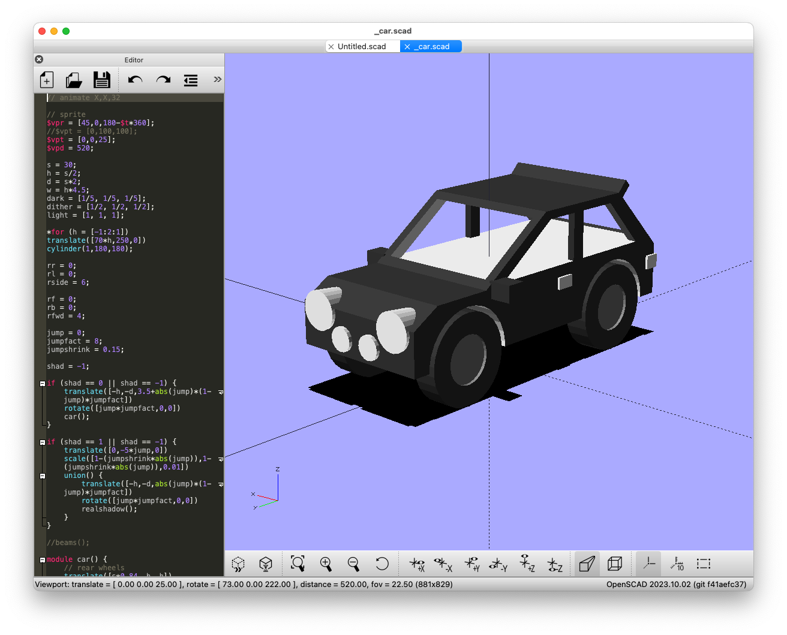
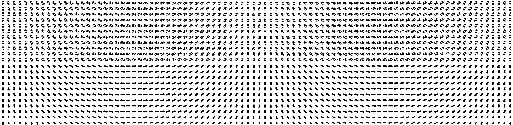

# OpenSCAD to Spritesheet

This takes a `OpenSCAD` model and exports `$ROTS` rotatations as individual frames. It's clever enough to ony process models that have changed: those whose modified date is newer than the existing generated images for that model.

After exporting all frames there is some `image magick` work to process the files as follows:
- stitch together
- split into RGBA channels
- recolou and dither
- recombine

## Notes

It was made for my game [Daily Driver](https://gingerbeardman.itch.io/daily-driver) so a lot of the values are set to produce tiny, 1-bit, dithered sprites across several different poses, resulting in sprite sheet with 990 frames each for car and shadow totalling 1980 frames per car.

## Example Model

## Example Output

